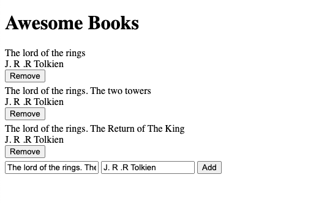

# Awesome Books

> Manage books collection

Working with Low Fidelity WireFrames

## Built With

- HTML, CSS & JS

## Getting Started

### Prerequisites
  - You should have VS Code installed or have the source-code editor of your preference.
### Setup
  - Paste the link of the repo (you can find it in the tab "Code").
### Install
  - Use terminal to install it. You can use git clone follow by link of the repo.
### Usage
  - Create a branch to make improvements in the project.

## Live Demo
[Awesome Books](https://crgc.github.io/microverse-awesome-books/)

## Authors

👤 **Christian Erick Contreras**

- GitHub: [@eri8-9](https://github.com/eri8-9)
- Linkedin: [LinkedIn](https:linkedin.com/in/christian-erick-contreras-9945b820b)
- Twitter: [@ChristianErick_](https://twitter.com/ChristianErick_)

👤  **Carlos González**
- GitHub: [@crgc](https://github.com/crgc)
- Twitter: [@aclerkofpomier](https://twitter.com/aclerkofpomier)
- LinkedIn: [Carlos González](https://www.linkedin.com/in/carlosrmgonzalez/)

## Show your support

Give a ⭐️ if you like this project!

## Acknowledgments

- Microverse

## 📝 License

-  This work is licensed under a <a rel="license" href="http://creativecommons.org/licenses/by-nc/4.0/">Creative Commons Attribution-NonCommercial 4.0 International License</a>.